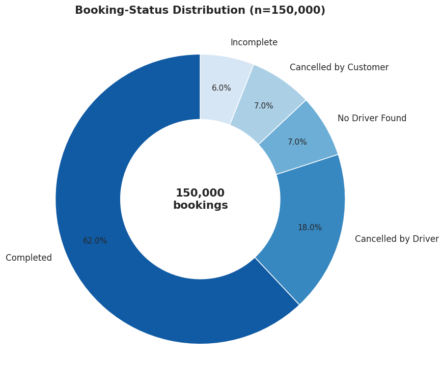
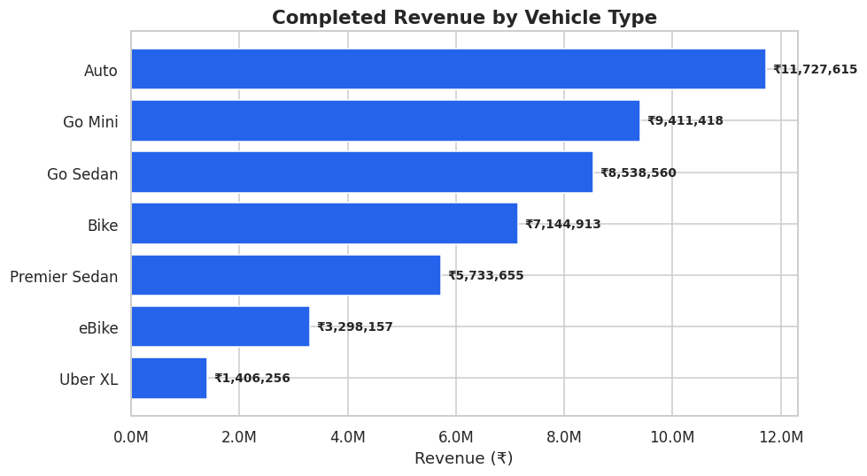
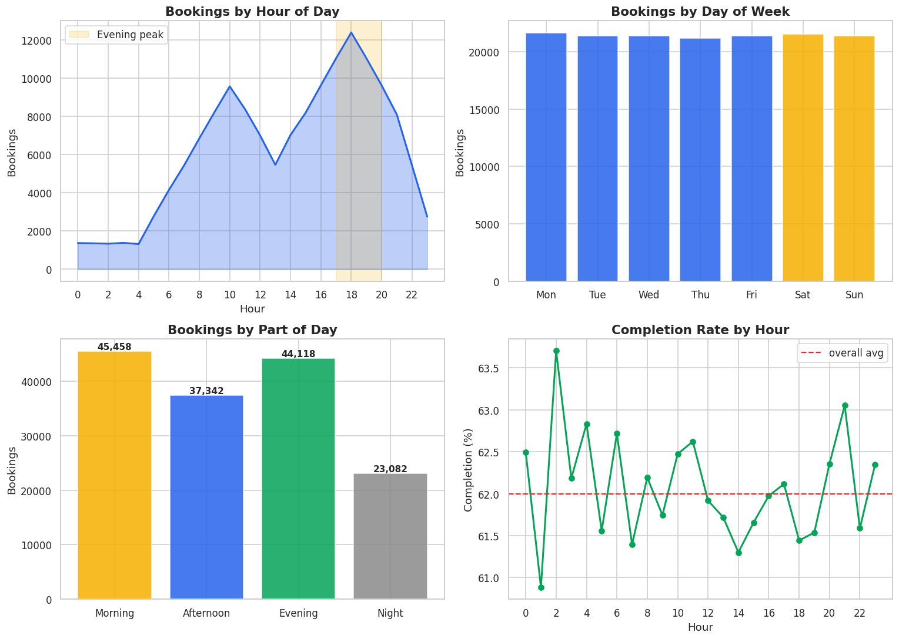

# 🚕 Driving Smarter Decisions: An End-to-End Ride-Hailing Business Performance Analysis

> Generating business insights from ride-hailing data across India's National Capital Region to support strategic planning, service optimization, customer retention, and data-driven decision-making.

<p align="center">
  
  
  
  
  
  
</p>

<p align="center">
  <a href="https://medium.com/@raihanmasyalhaidar/driving-smarter-decisions-an-end-to-end-ride-hailing-business-performance-analysis-9f33b2cec518">📖 Read the full article on Medium</a>
</p>

---

## 📌 Overview

Ride-hailing platforms operate as two-sided marketplaces: riders create demand, drivers provide supply, and the platform earns revenue only when the two are matched and a trip completes. Every unsuccessful booking is therefore a lost revenue opportunity and a potential dent in customer trust.

This project analyzes **150,000 ride-booking records** from the National Capital Region (NCR) to answer three operational questions: **where demand is lost throughout the booking funnel, what financial impact those losses create, and which interventions offer the greatest potential to improve performance.**

The headline finding is a significant efficiency gap. Only **62% of booking requests result in completed rides**, while the remaining **38% (≈57,000 bookings)** fail to convert, corresponding to an estimated **₹29.0 million** in unrealized booking value. Statistical testing further shows that completion and fare are **independent of vehicle type and payment method**, so the largest opportunities lie not in pricing or product mix, but in **improving booking completion** and **strengthening customer retention** (where **99.5% of riders use the platform only once**).

---

## 🔑 Key Findings

| Theme | Finding |
|---|---|
| **Funnel** | Only **62%** of bookings complete; **38% (~57,000)** fail across driver cancellations, no-driver-found, customer cancellations, and incompletes |
| **Revenue leakage** | ≈ **₹29.0M** in unrealized value; recovering **20%** ≈ **₹5.8M**; each **+1pt** of completion ≈ **₹0.76M** |
| **Pricing & mix** | Fare and completion are **statistically independent** of vehicle type and payment method (no premium or best-converting segment) |
| **Revenue driver** | Revenue follows **volume, not margin**, avg fare ≈ **₹508** and ₹/km ≈ **19.5** across all vehicle types |
| **Demand timing** | Peaks in the **evening commute (17:00–20:00)**; demand is steady across weekdays |
| **Retention** | **99.5%** of customers ride only once, the single biggest long-term opportunity |
| **Ratings** | High and uniform (customer ≈ **4.41**, driver ≈ **4.23**); uncorrelated with wait time, so not a useful operational signal |
| **Geography** | Demand is **dispersed** across 176 pickup zones and 30,000+ routes; the busiest route has only ~17 trips |

---

## 🗂️ Table of Contents

- [Business Problem](#-business-problem)
- [Dataset](#-dataset)
- [Methodology](#-methodology)
- [Analysis Highlights](#-analysis-highlights)
- [Strategic Recommendations](#-strategic-recommendations)
- [Project Structure](#-project-structure)
- [Tech Stack](#-tech-stack)
- [Reproduce This Analysis](#-reproduce-this-analysis)
- [Read More](#-read-more)
- [License](#-license)

---

## 🎯 Business Problem

Management can readily see how many bookings were made and how much revenue was earned, but routine reporting leaves the most important questions unanswered:

- How much of the demand that enters the funnel is actually captured as completed rides, and where does the rest leak out?
- What is the financial cost of non-completion, and which lever would recover the most value?
- Are revenue, fare, and completion meaningfully different across vehicle types and payment methods, or are those differences statistically insignificant?
- Who are the platform's customers, and how strong is repeat usage?
- When does demand peak, creating both the greatest opportunity and the greatest operational strain?

At its core, this is a problem of **decision visibility**: large volumes of booking data are collected continuously, but have not yet been transformed into insight that drives supply strategy, retention initiatives, and operational priorities.

---

## 💾 Dataset

**Source:** [Uber Ride Analytics Dashboard](https://www.kaggle.com/datasets/yashdevladdha/uber-ride-analytics-dashboard) by **yashdevladdha** on Kaggle.

**`ncr_ride_bookings.csv`** — 150,000 ride-booking records from the NCR, with 21 variables per record covering booking timestamps, booking status, vehicle type, pickup/drop-off locations, trip distance, fare amounts, turnaround times, ratings, payment methods, and cancellation reasons where applicable.

> **⚠️ A note on structural missingness.** Much of this dataset's missing data is **structural, not erroneous**. Cancellation reasons exist only for cancelled bookings; fares, distances, and ratings exist primarily for completed rides. These blanks reflect business processes rather than data-quality issues, so the cleaning approach **preserves that logic** instead of imputing values that would distort operational reality. The notebook explicitly **proves** this by measuring field completeness across booking outcomes.

---

## 🔬 Methodology

The analysis follows a structured, reproducible framework. Each stage builds on the previous one, and every figure regenerates from the source CSV by running the notebook top to bottom.

1. **Data Quality Assessment** — completeness, missing-value patterns, and whether missingness is structural or a quality issue.
2. **Data Cleaning & Preparation** — standardize formats, normalize placeholder values, coerce types, parse datetimes, and run validity checks.
3. **Feature Engineering** — temporal attributes (hour, day, peak/off-peak), distance and revenue bands, fare-per-km, and explicit booking-outcome flags.
4. **Exploratory Data Analysis** — funnel, demand patterns, vehicle performance, route/geographic structure, fare behavior, and distance patterns.
5. **Diagnostic Analysis** — cancellation root causes, revenue-leakage quantification, retention behavior, and rating/service quality.
6. **Business Synthesis & Recommendations** — prioritized, quantified, data-driven recommendations.

---

## 📈 Analysis Highlights

### The Booking Funnel & Revenue Leakage

<p align="center"></p>

Of 150,000 bookings, **93,000 (62%) complete**. The remaining 38% fail across four modes, dominated by **supply-side failures** (driver cancellations + no-driver-found). Using the average completed fare as a proxy, the ≈57,000 failed bookings represent **≈₹29.0M** in unrealized value, recovering even a fraction is worth millions.

### Revenue Follows Volume, Not Margin

<p align="center"></p>

Auto earns the most revenue simply because it is booked most. Average fare (~₹508), completion (~62%), and ₹/km (~19.5) are nearly identical across every vehicle type, confirmed by formal hypothesis tests showing no significant differences.

### Demand Peaks in the Evening Commute

<p align="center"></p>

Booking volume crests at **~18:00**, and completion rate stays in a narrow 61–64% band all day, so the operational challenge at peak is **volume**, not a collapse in conversion.

---

## 🚀 Strategic Recommendations

* **Reduce Cancellation-Driven Revenue Leakage**
  Driver cancellations are a major source of booking failures. Implement driver reliability scoring and stronger cancellation controls to improve completion rates and recover lost revenue.

* **Make Completion Rate the Primary KPI**
  Prioritize completion rate over booking volume as the core performance metric, since completed rides directly drive revenue and customer satisfaction.

* **Strengthen Customer Retention**
  Introduce second-ride incentives, seamless payment options, and frictionless rebooking to increase repeat usage and customer lifetime value.

* **Optimize Supply During Peak Hours**
  Focus driver incentives and supply allocation between **17:00–20:00**, when demand is highest and booking failures are most costly.

* **Improve Supply Efficiency**
  Use zone-based driver positioning and rebalancing strategies to better match geographically dispersed demand.

### Key Takeaway

The platform's largest growth opportunities lie in **improving completion rates, reducing cancellations, and increasing customer retention**. These initiatives are expected to deliver greater business impact than changes to pricing, payment methods, or vehicle categories.

---

## 📁 Project Structure

```
ride-hailing-performance-analysis/
├── README.md                                          # You are here
├── Ride_Hailing_Business_Performance_Analysis.ipynb   # Full reproducible analysis
├── Ride_Hailing_Performance_Report.docx               # Detailed written report
├── data/
│   └── README.md                                      # How to add the dataset
├── charts/                                            # Exported figures
│   ├── funnel_pie.png
│   ├── temporal.png
│   ├── vehicle_revenue.png
│   ├── revenue_breakdown.png
│   ├── locations.png
│   ├── distance_dist.png
│   ├── rating_by_vehicle.png
│   ├── cancellation.png
│   └── segments.png
├── requirements.txt
└── LICENSE
```

---

## 🛠️ Tech Stack

| Purpose | Tools |
|---|---|
| Data wrangling | `pandas`, `numpy` |
| Visualization | `matplotlib`, `seaborn` |
| Machine learning | `scikit-learn` (StandardScaler, KMeans) |
| Statistics | `scipy.stats` (t-test, ANOVA, chi-square) |
| Environment | `Jupyter Notebook`, Python 3.11 |

---

## ⚙️ Reproduce This Analysis

```bash
# 1. Clone the repo
git clone https://github.com/<your-username>/ride-hailing-performance-analysis.git
cd ride-hailing-performance-analysis

# 2. (Recommended) create a virtual environment
python -m venv venv
source venv/bin/activate      # Windows: venv\Scripts\activate

# 3. Install dependencies
pip install -r requirements.txt

# 4. Add the dataset
#    Download ncr_ride_bookings.csv from Kaggle (link in the Dataset section)
#    and place it in ./data/  (or anywhere, the loader auto-finds it)

# 5. Run the notebook top to bottom
jupyter notebook Ride_Hailing_Business_Performance_Analysis.ipynb
```

> The notebook includes a portable loader that searches common locations (`./`, `./data/`, `/kaggle/input/`) for the CSV, so there are no hard-coded paths to edit.

---

## 📚 Read More

- 📖 **Full article on Medium:** [Driving Smarter Decisions: An End-to-End Ride-Hailing Business Performance Analysis](https://medium.com/@raihanmasyalhaidar/driving-smarter-decisions-an-end-to-end-ride-hailing-business-performance-analysis-9f33b2cec518)
- 📄 **Detailed report:** `Ride_Hailing_Performance_Report.docx`
- 💾 **Dataset:** [Uber Ride Analytics Dashboard](https://www.kaggle.com/datasets/yashdevladdha/uber-ride-analytics-dashboard) (Kaggle)

---

## 📝 License

Released under the [MIT License](LICENSE). Dataset subject to its original source's terms.

---

<p align="center">
  <i>Written by <b>Raihan Masyal Haidar</b> · If this analysis was useful, consider giving the repo a ⭐</i>
</p>
