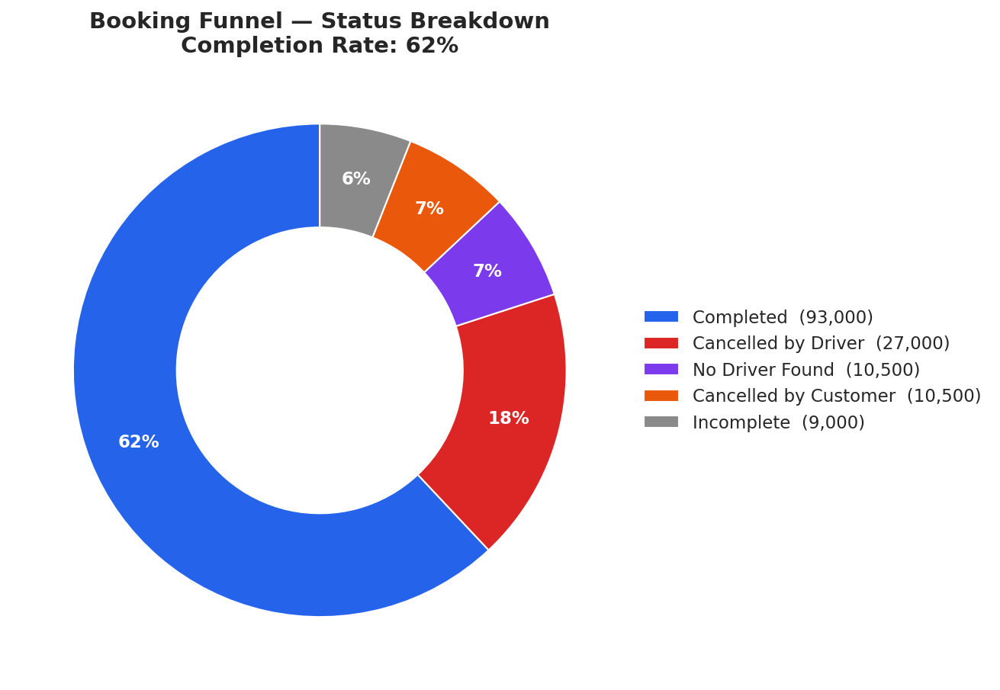
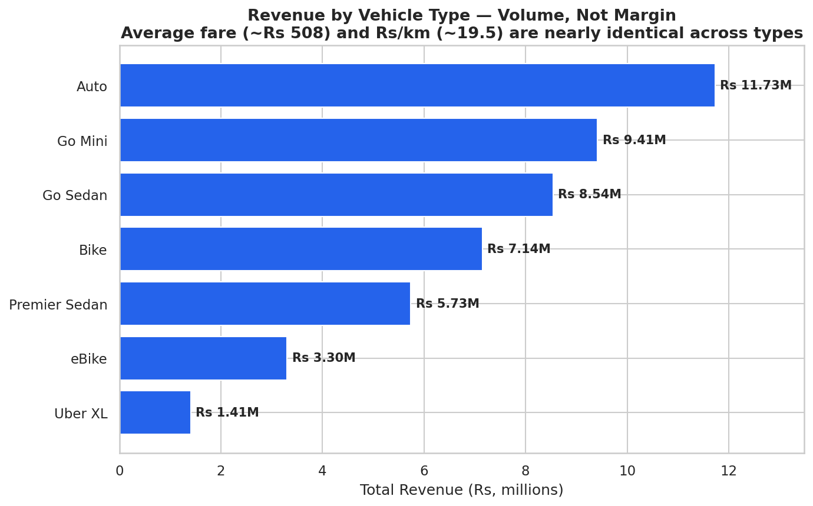
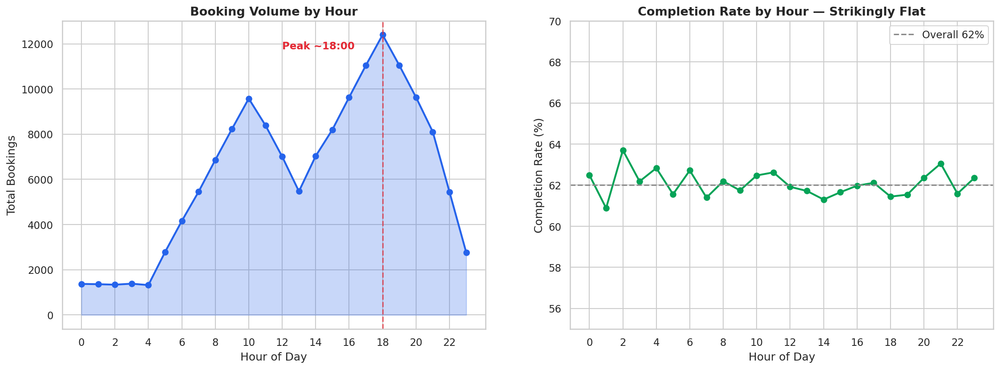
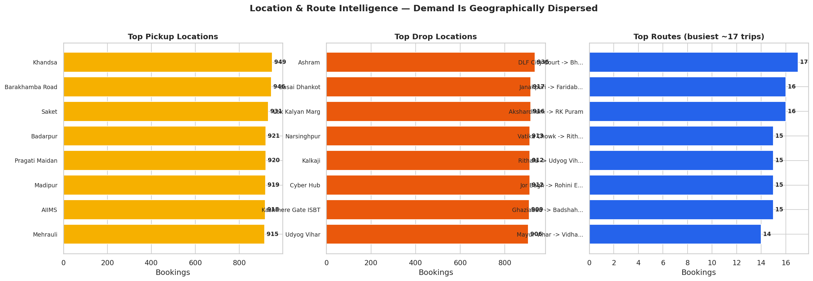
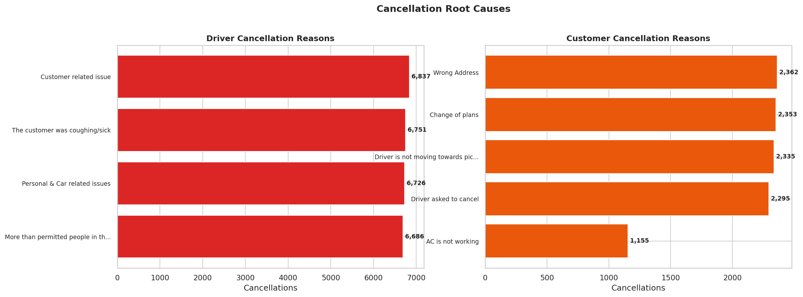
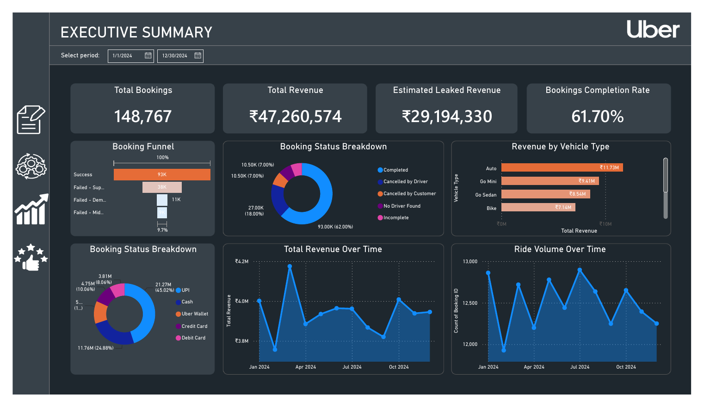
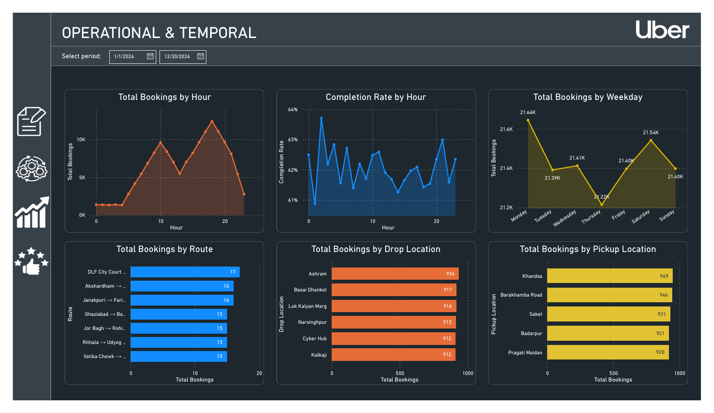
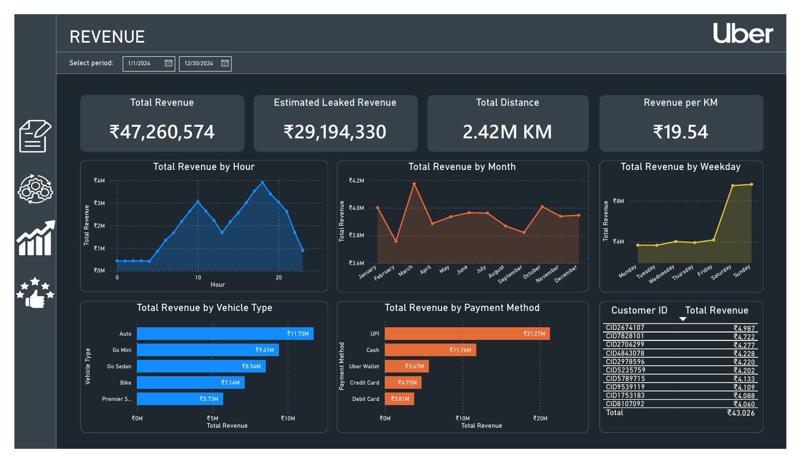
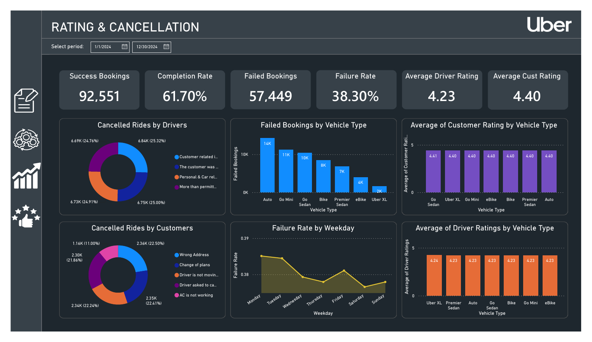

# 🚕 End-to-End Ride-Hailing Business Analytics: From Python to Power BI

> Generating business insights from ride-hailing data across India's National Capital Region to support strategic planning, service optimization, customer retention, and data-driven decision-making — from raw data in **Python**, through **SQL analysis in SQLite**, to an interactive **Power BI** dashboard.


---

## 📌 Overview

Ride-hailing platforms operate as two-sided marketplaces: riders create demand, drivers provide supply, and the platform earns revenue only when the two are matched and a trip completes. Every unsuccessful booking is therefore a lost revenue opportunity and a potential dent in customer trust.

This project analyzes **150,000 ride-booking records** from the National Capital Region (NCR) to answer three operational questions: **where demand is lost throughout the booking funnel, what financial impact those losses create, and which interventions offer the greatest potential to improve performance.**

The headline finding is a significant efficiency gap. Only **62% of booking requests result in completed rides**, while the remaining **38% (≈57,000 bookings)** fail to convert, corresponding to an estimated **₹29.0 million** in unrealized booking value. Statistical testing further shows that completion and fare are **independent of vehicle type and payment method**, so the largest opportunities lie not in pricing or product mix, but in **improving booking completion** and **strengthening customer retention** (where **~99% of riders use the platform only once**). A machine-learning model deliberately confirms that booking failure is **unpredictable from static attributes (ROC-AUC ≈ 0.50)** — powerful evidence that failure is driven by real-time operational factors, not by the type of trip being booked.

Unlike a single-notebook study, this project is delivered as a **full analytics pipeline**:

```
Python  ──▶  SQLite  ──▶  Power BI
(data         (SQL           (interactive
preparation,   analytics,     dashboards,
EDA, ML)       window         business metrics,
               functions)     DAX calculations)
```

---

## 🔑 Key Findings

| Theme | Finding |
| --- | --- |
| **Funnel** | Only **62%** of bookings complete; **38% (~57,000)** fail across driver cancellations, no-driver-found, customer cancellations, and incompletes |
| **Revenue leakage** | ≈ **₹29.0M** in unrealized value; recovering **20%** ≈ **₹5.8M**; each **+1pt** of completion ≈ **₹0.76M** |
| **Pricing & mix** | Fare and completion are **statistically independent** of vehicle type and payment method (no premium or best-converting segment) |
| **Revenue driver** | Revenue follows **volume, not margin** — avg fare ≈ **₹508** and ₹/km ≈ **19.5** across all vehicle types |
| **Demand timing** | Peaks in the **evening commute (17:00–20:00)**, ~18:00 busiest; demand is steady across weekdays |
| **Retention** | **~99%** of customers ride only once — the single biggest long-term opportunity |
| **Machine learning** | Booking failure is **unpredictable from static features (ROC-AUC ≈ 0.50)** — failure is dynamic/operational, not attribute-based |
| **Ratings** | High and uniform (customer ≈ **4.41**, driver ≈ **4.23**); uncorrelated with wait time, so not a useful operational signal |
| **Geography** | Demand is **dispersed** across 176 pickup zones and thousands of routes; the busiest route has only ~17 trips |

---

## 🗂️ Table of Contents

- [Business Problem](#-business-problem)
- [Dataset](#-dataset)
- [Pipeline & Methodology](#-pipeline--methodology)
- [Analysis Highlights](#-analysis-highlights)
- [SQL Analysis](#-sql-analysis)
- [Machine Learning](#-machine-learning)
- [Power BI Dashboard](#-power-bi-dashboard)
- [Strategic Recommendations](#-strategic-recommendations)
- [Project Structure](#-project-structure)
- [Tech Stack](#-tech-stack)
- [Reproduce This Analysis](#️-reproduce-this-analysis)
- [Read More](#-read-more)
- [License](#-license)

---

## 🎯 Business Problem

Management can readily see how many bookings were made and how much revenue was earned, but routine reporting leaves the most important questions unanswered:

- How much of the demand that enters the funnel is actually captured as completed rides, and where does the rest leak out?
- What is the financial cost of non-completion, and which lever would recover the most value?
- Are revenue, fare, and completion meaningfully different across vehicle types and payment methods, or are those differences statistically insignificant?
- Who are the platform's customers, and how strong is repeat usage?
- When does demand peak, creating both the greatest opportunity and the greatest operational strain?
- Can booking outcomes be predicted from the data available at booking time?

At its core, this is a problem of **decision visibility**: large volumes of booking data are collected continuously, but have not yet been transformed into insight that drives supply strategy, retention initiatives, and operational priorities.

---

## 💾 Dataset

**Source:** [Uber Ride Analytics Dashboard](https://www.kaggle.com/datasets/yashdevladdha/uber-ride-analytics-dashboard) by **yashdevladdha** on Kaggle.

**`ncr_ride_bookings.csv`** — 150,000 ride-booking records from the NCR, with 21 variables per record covering booking timestamps, booking status, vehicle type, pickup/drop-off locations, trip distance, fare amounts, turnaround times, ratings, payment methods, and cancellation reasons where applicable.

**Booking funnel composition:**

| Booking Status | Count | Share |
| --- | ---: | ---: |
| Completed | 93,000 | 62.0% |
| Cancelled by Driver | 27,000 | 18.0% |
| No Driver Found | 10,500 | 7.0% |
| Cancelled by Customer | 10,500 | 7.0% |
| Incomplete | 9,000 | 6.0% |

> **⚠️ A note on structural missingness.** Much of this dataset's missing data is **structural, not erroneous**. Cancellation reasons exist only for cancelled bookings; fares, distances, and ratings exist primarily for completed rides. These blanks reflect business processes rather than data-quality issues, so the cleaning approach **preserves that logic** instead of imputing values that would distort operational reality. The notebook explicitly **proves** this by measuring field completeness across booking outcomes.

---

## 🔬 Pipeline & Methodology

The analysis follows a structured, reproducible framework. Data is cleaned and modelled in Python, queried in SQLite, exported as a star schema, and visualized in Power BI. Every figure regenerates from the source CSV by running the notebook top to bottom.

1. **Data Quality Assessment** — completeness, missing-value patterns, and whether missingness is structural or a quality issue.
2. **Data Cleaning & Preparation** — standardize formats, normalize placeholder values, coerce types, parse datetimes, and run validity checks.
3. **Feature Engineering** — temporal attributes (hour, day, peak/off-peak), distance and revenue bands, fare-per-km, routing, and explicit booking-outcome flags.
4. **Exploratory Data Analysis** — funnel, demand patterns, vehicle performance, route/geographic structure, fare behavior, and distance patterns.
5. **Diagnostic Analysis** — cancellation root causes, revenue-leakage quantification, retention behavior, and rating/service quality.
6. **Customer Segmentation** — trip-based K-Means clustering (classic RFM is degenerate given ~99% single-ride customers).
7. **SQL Analysis (SQLite)** — 30+ business queries including window functions (`RANK`, `DENSE_RANK`, `ROW_NUMBER`, `NTILE`).
8. **Machine Learning** — fare regression, booking-failure classification, and daily-demand time-series forecasting.
9. **Data Modelling & Export** — a star schema (fact + 5 dimension tables) exported for Power BI.
10. **Business Synthesis & Recommendations** — prioritized, quantified, data-driven recommendations.

---

## 📈 Analysis Highlights

### The Booking Funnel & Revenue Leakage



Of 150,000 bookings, **93,000 (62%) complete**. The remaining 38% fail across four modes, dominated by **supply-side failures** (driver cancellations + no-driver-found, ≈25% of all bookings). Using the average completed fare (≈₹508) as a proxy, the ≈57,000 failed bookings represent **≈₹29.0M** in unrealized value. Recovering even 20% is worth ≈₹5.8M, and **each +1 percentage point of completion ≈ ₹0.76M**.

### Revenue Follows Volume, Not Margin



Auto earns the most revenue (≈₹11.7M) simply because it is booked most. Average fare (~₹508), completion (~62%), and ₹/km (~19.5) are nearly identical across **every** vehicle type — confirmed by formal hypothesis tests (ANOVA, chi-square) showing no significant differences. Payment method (UPI ≈₹21.3M, Cash ≈₹11.8M) and peak vs. off-peak revenue (≈₹23.4M vs. ≈₹23.9M) tell the same story: revenue is driven by **volume**, not price.

### Demand Peaks in the Evening Commute



Booking volume crests at **~18:00**, and completion rate stays in a narrow **61–64%** band all day. So the operational challenge at peak is **volume**, not a collapse in conversion — which means small completion gains during the evening peak deliver outsized revenue impact.

### Location & Route Intelligence



Demand is **highly dispersed**: top pickup zones (Khandsa, Barakhamba Road, Saket…) differ by only a handful of bookings, and the busiest route records only ~17 trips out of 150,000. There are no high-density corridors, so supply strategy should be **zone-level**, not route-level.

### Cancellation Root Causes



Driver cancellations spread evenly across four causes (~6,700–6,850 each) — no single dominant factor, so reducing them needs a multi-pronged approach. Customer cancellations are led by **Wrong Address** and **Change of Plans**, several of which are directly addressable through better address validation and pickup-pin confirmation.

---

## 🗄️ SQL Analysis

The cleaned dataset is loaded into **SQLite**, where **30+ business queries** answer operational questions directly in SQL — mirroring how an analyst queries a real warehouse. Coverage includes funnel metrics, revenue by dimension, temporal breakdowns, top/bottom rankings, and **window functions**.

```sql
-- Rank pickup zones by revenue WITHIN each vehicle type (window function)
WITH area_veh AS (
    SELECT Vehicle_Type, Pickup_Location,
           SUM(CASE WHEN Booking_Status = 'Completed'
                    THEN Booking_Value ELSE 0 END) AS revenue
    FROM bookings
    GROUP BY Vehicle_Type, Pickup_Location
)
SELECT Vehicle_Type, Pickup_Location, revenue,
       RANK() OVER (PARTITION BY Vehicle_Type ORDER BY revenue DESC) AS rank_in_vehicle
FROM area_veh
ORDER BY Vehicle_Type, rank_in_vehicle;
```

A representative result: ranking customers by total spend shows even the platform's **top customer spent under ₹5,000** across the entire year — there are no "whale" customers, reinforcing that strategy must lift the whole base rather than a lucrative few.

---

## 🤖 Machine Learning

Three honest modelling tasks, each with a clear business purpose:

| Task | Model(s) | Result | Interpretation |
| --- | --- | --- | --- |
| **Fare regression** | Linear Regression | R² ≈ 0.00 | Fare is a simple function of distance — no hidden pricing leakage |
| **Booking-failure classification** | Logistic Regression, Random Forest, Gradient Boosting | **ROC-AUC ≈ 0.50** | Failure is **unpredictable from static features** — it's driven by real-time factors |
| **Demand forecasting** | Seasonal decomposition + 14-day forecast | ~411 bookings/day, stable | Mature, plateaued demand — growth must be manufactured, not awaited |

The classification result is the intellectual centerpiece. Using **only features known at booking time** (vehicle, location, hour, day — no post-trip leakage), all three models perform no better than chance:

| Model | Accuracy | Precision | Recall | F1 | ROC-AUC |
| --- | ---: | ---: | ---: | ---: | ---: |
| Logistic Regression | 0.50 | 0.38 | 0.48 | 0.42 | 0.50 |
| Random Forest | 0.52 | 0.38 | 0.42 | 0.40 | 0.50 |
| Gradient Boosting | 0.62 | 0.42 | 0.00 | 0.00 | 0.50 |

Reported honestly, this is **evidence, not failure**: because failure can't be predicted from *static* attributes, it must be driven by **dynamic, real-time factors** the dataset doesn't capture (live driver availability, traffic, momentary decisions). That reframes the solution — **fix the real-time supply system, don't filter "bad" bookings.**

---

## 📊 Power BI Dashboard

The cleaned data is modelled into a **star schema** (`fact_bookings` + `dim_date`, `dim_vehicle`, `dim_location`, `dim_payment`, `dim_status`) and visualized in a **four-page Power BI dashboard** powered by **24 custom DAX measures**.

### Executive Summary


### Operational & Temporal


### Revenue


### Rating & Cancellation


Example DAX measures:

```dax
Completion Rate =
DIVIDE ( [Completed Bookings], [Total Bookings] )

Total Revenue =
CALCULATE ( SUM ( fact_bookings[booking_value] ), fact_bookings[is_completed] = 1 )

Estimated Leaked Revenue =
[Failed Bookings] * [Average Fare]

Value per 1pt Completion =
[Total Bookings] * 0.01 * [Average Fare]
```

> 📄 The full four-page dashboard is also available as a PDF export in [`dashboard/Dashboard_Power_BI.pdf`](dashboard/Dashboard_Power_BI.pdf).

---

## 🚀 Strategic Recommendations

- **Reduce Cancellation-Driven Revenue Leakage.** Driver cancellations are the largest source of booking failures. Implement driver reliability scoring and stronger cancellation controls to improve completion and recover lost revenue.

- **Make Completion Rate the Primary KPI.** Prioritize completion rate over booking volume — each +1 point ≈ ₹0.76M, and completion directly drives revenue and satisfaction.

- **Strengthen Customer Retention.** With ~99% one-time riders, second-ride incentives, seamless payment, and frictionless rebooking are the biggest long-term lever on customer lifetime value.

- **Optimize Supply During Peak Hours.** Focus driver incentives and allocation between **17:00–20:00**, when demand is highest and failures are most costly.

- **Reduce Avoidable Customer Cancellations.** Strengthen pickup-location verification and pin confirmation to cut *Wrong Address* cancellations; improve driver-status visibility to cut delay-driven ones.

- **Improve Supply Efficiency at the Zone Level.** Demand is geographically dispersed with no dominant corridors, so use zone-based driver positioning and rebalancing rather than route-based optimization.

- **Instrument for Predictive Operations.** Capture real-time driver location/status at booking time — the missing ingredient that would make a genuinely predictive failure model possible.

### Key Takeaway

The platform's largest growth opportunities lie in **improving completion rates, reducing cancellations, and increasing customer retention**. These initiatives are expected to deliver greater business impact than changes to pricing, payment methods, or vehicle categories.

---

## 📁 Project Structure

```
ride-hailing-performance-analysis/
├── README.md                       # You are here
├── MEDIUM_ARTICLE.md               # Full write-up (ready to publish on Medium)
├── Ride_Hailing.ipynb              # Full reproducible analysis (Python → SQLite → export)
├── ncr_ride_bookings.csv           # Raw source dataset (150K rows)
├── export_charts.py                # Regenerates every figure in charts/ from the raw data
├── requirements.txt                # Python dependencies
├── LICENSE                         # MIT
├── .gitignore
├── charts/                         # Figures used in the README & article
│   ├── funnel_pie.png
│   ├── vehicle_revenue.png
│   ├── temporal.png
│   ├── locations.png
│   ├── cancellation.png
│   ├── dashboard_executive.png
│   ├── dashboard_operational.png
│   ├── dashboard_revenue.png
│   └── dashboard_rating.png
└── dashboard/
    └── Dashboard_Power_BI.pdf      # Static export of the 4-page dashboard
```

---

## 🛠️ Tech Stack

| Purpose | Tools |
| --- | --- |
| Data wrangling | `pandas`, `numpy` |
| Visualization | `matplotlib`, `seaborn`, `plotly` |
| Statistics | `scipy.stats` (t-test, ANOVA, chi-square), `statsmodels` |
| Machine learning | `scikit-learn` (LogisticRegression, RandomForest, GradientBoosting, KMeans, LinearRegression) |
| Database / SQL | `SQLite` (`sqlite3`) — 30+ queries incl. window functions |
| Business intelligence | Microsoft Power BI (DAX, Power Query, star-schema modelling) |
| Environment | `Jupyter Notebook`, Python 3.14 |

---

## ⚙️ Reproduce This Analysis

```bash
# 1. Clone the repo
git clone https://github.com/<your-username>/ride-hailing-performance-analysis.git
cd ride-hailing-performance-analysis

# 2. (Recommended) create a virtual environment
python -m venv venv
source venv/bin/activate      # Windows: venv\Scripts\activate

# 3. Install dependencies
pip install -r requirements.txt

# 4. Run the notebook top to bottom
jupyter notebook Ride_Hailing.ipynb

# 5. (Optional) regenerate the README charts from the raw data
python export_charts.py
```

Running the notebook regenerates `clean_dataset.csv` and `analysis_database.db`. To explore the dashboard, open the Power BI file in **Power BI Desktop** (free) and point its data source at the generated database or clean CSV.

> **Tip (Power BI):** derive the weekday sort order from the date column (`WEEKDAY([date], 2)`) rather than from the weekday text, to avoid a circular-dependency error between `Weekday` and its sort column.

---

## 📚 Read More

- 📖 **Full write-up:** see [`MEDIUM_ARTICLE.md`](MEDIUM_ARTICLE.md) in this repo — ready to publish on Medium. *(Add your published Medium link here once live.)*
- 💾 **Dataset:** [Uber Ride Analytics Dashboard](https://www.kaggle.com/datasets/yashdevladdha/uber-ride-analytics-dashboard) (Kaggle)

---

## 📝 License

Released under the [MIT License](LICENSE). Dataset subject to its original source's terms.

---

*If this analysis was useful, consider giving the repo a ⭐*
